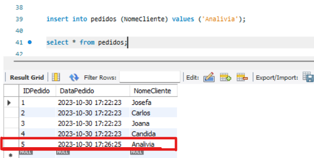
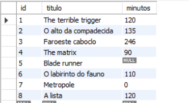
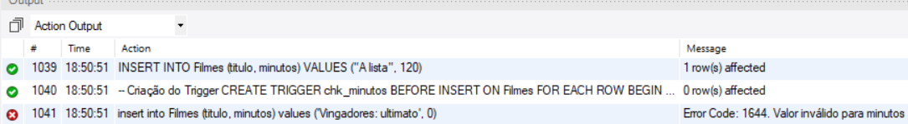
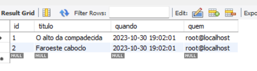

# trigger

## Exemplo 1
a)Com a criação do Trigger o gatilho garante que a coluna "DataPedido"seja automaticamente preenchida com a data e hora atuais toda vez que alguém insere um novo registro na tabela "Pedidos":
```sql
DELIMITER $
CREATE TRIGGER RegistroDataCriacaoPedido
BEFORE INSERT ON Pedidos
FOR EACH ROW
BEGIN
-- **Comando SQL**
SET NEW. DataPedido = NOW();
END;
$
DELIMITER ;

```


## Exemplo 2 
### APÓS A EXECUÇÃO DO PRIMEIRO CÓDIGO REALIZE O SEGUNDO EXEMPLO;

a)Criado a tabela filmes:

b)O gatilho "chk_minutos" é projetado para evitar que valores não válidos(ou seja, valores menores ou iguais a zero) sejam inseridos na coluna "minutos" da tabela "Filmes".Se um valor inválido for inserido,o gatilho redefine o valor como NULL. Isso ajuda a garantir a integridade dos dados na tabela conforme imagem ilustrada:
```sql
create trigger check_minutos before insert on filmes

-- O gatilho vai iterar por cada linha afetada pela inserção
for each row

-- Início do bloco do gatilho
begin
    -- Condição: Verificar se o valor da coluna "minutos" na nova linha ("new.minutos") é menor que 0
    if new.minutos < 0 then
        -- Se a condição for atendida, o gatilho será acionado
        -- Ele define o valor da coluna "minutos" como NULL
        set new.minutos = null;
    end if;
-- Fim do bloco do gatilho
end$

-- Restauração do Delimitador padrão
delimiter ;

```
### inserindo os dados
```sql
INSERT INTO Filmes (titulo, minutos) VALUES ("The terrible trigger", 120);
INSERT INTO Filmes (titulo, minutos) VALUES ("O alto da compadecida", 135);
INSERT INTO Filmes (titulo, minutos) VALUES ("Faroeste caboclo", 246);
INSERT INTO Filmes (titulo, minutos) VALUES ("The matrix", 90);
INSERT INTO Filmes (titulo, minutos) VALUES ("Blade runner", -88);
INSERT INTO Filmes (titulo, minutos) VALUES ("O labirinto do fauno", 110);
INSERT INTO Filmes (titulo, minutos) VALUES ("Metropole", 0);
INSERT INTO Filmes (titulo, minutos) VALUES ("A lista", 120);
```


### Trigger Chk_minutos

```sql
DELIMITER $
-- Criação do Trigger que alem de mandar
CREATE TRIGGER chk_minutos BEFORE INSERT ON Filmes
FOR EACH ROW
BEGIN
    DECLARE custom_message VARCHAR(255);

    IF new.minutos <= 0 THEN
        -- Atribuir a mensagem de erro personalizada à variável
        SET custom_message = "O valor em miutos está invalido";

        -- Lançar um Erro com mensagem personalizada e código de erro
        SIGNAL SQLSTATE '22007' SET MESSAGE_TEXT = custom_message;
    END IF;
END$
-- Restauração do Delimitador Padrão
DELIMITER ;
```



### Trigger log_deletions
```sql
create table Log_deletions (
id int primary key not null auto_increment,
titulo varchar(60),
quando datetime,
quem varchar(40)
);

-- **Declaração do gatilho**
DELIMITER $
create trigger log_deletions after delete on Filmes
	for each row 
    begin
		-- **Comando SQL**
		insert into Log_deletions values (null, old.titulo, sysdate(), user());
	end$
DELIMITER ;
```



